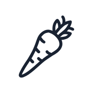

# 29 Vegetable SVG Icons — Customizable Set for App Designers

> Download 29 unique vegetable icons in 4 styles. Ready for Figma and Sketch projects needing fresh, minimal food visuals. Just $4.99.

## 4 free icons + 25 more in the full pack

This repository contains **4 free preview icons** from the 29-icon pack.
Use these freely in any project. No attribution required.

### Get the full 29-icon pack

- **$4.99** on Gumroad: [https://ecomgendesign.gumroad.com/l/vegetable-icons](https://ecomgendesign.gumroad.com/l/vegetable-icons)
- **Live preview:** [https://e-comgen.site/packs/vegetable-icons-pack](https://e-comgen.site/packs/vegetable-icons-pack)

## Free icons in this repo

| Icon | File |
|---|---|
|  | [`preview/asparagus-spear.svg`](preview/asparagus-spear.svg) |
|  | [`preview/cabbage.svg`](preview/cabbage.svg) |
|  | [`preview/jicama.svg`](preview/jicama.svg) |
|  | [`preview/parsnip.svg`](preview/parsnip.svg) |

## How to use

**HTML / CSS:**
```html

```

**Figma / Sketch / Adobe XD:**
Drag-drop SVG into your design tool. Becomes editable vector.

**React:**
```jsx
import { ReactComponent as Icon } from './preview/asparagus-spear.svg';
<Icon className="w-6 h-6" />
```

## License

Free icons in this repo: **MIT License** — use freely.
Full pack (29 icons): commercial license, no attribution. See full pack on Gumroad.

---

Made by [e-ComGen Design](https://e-comgen.site) — SVG asset packs for designers and developers.